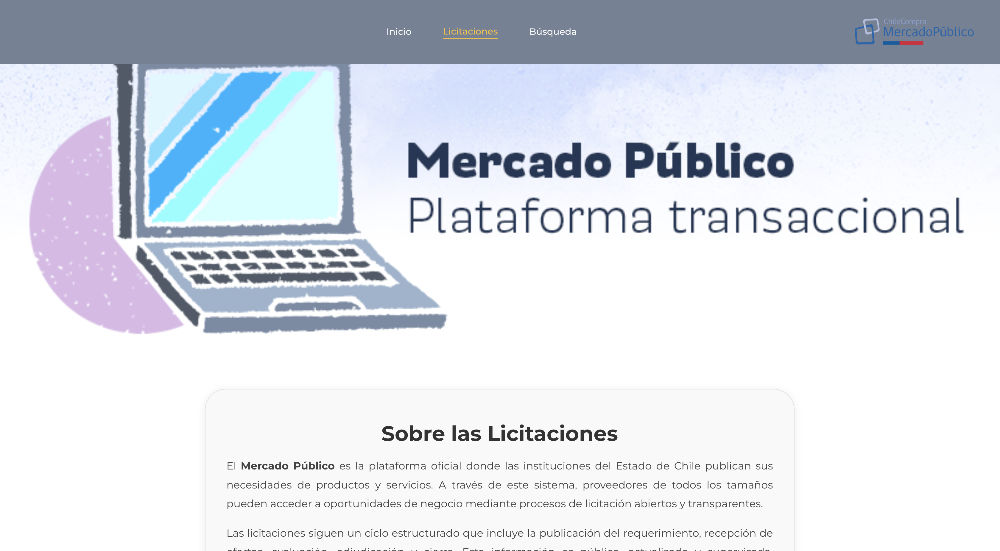
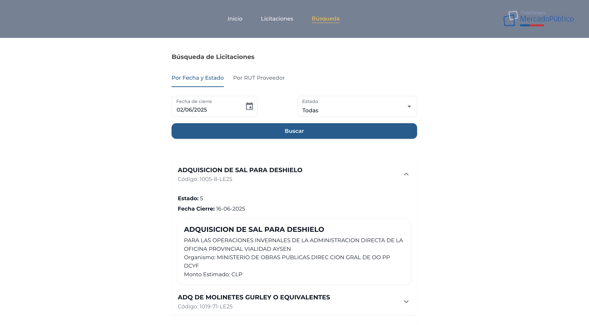
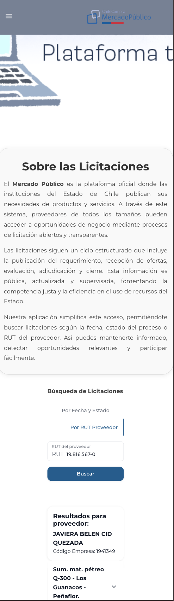

# 🌐 Sitio web para emprendimiento local

## 🧪 Evaluación III – Desarrollo Front End  
**Sección 51**  
**Profesor:** Víctor Zapata  

### 👨‍💻 Desarrolladores:
- Carlos González  
- Amanecer Cabrera  
- Emerson Ramírez  

# Buscador de Licitaciones - Mercado Público

Este proyecto es una aplicación en **React** que permite buscar, visualizar y entender licitaciones públicas publicadas en el **Mercado Público de Chile**, utilizando su API oficial. Está diseñado con **Material UI** para una interfaz elegante y responsive, y animado con **Framer Motion** para una experiencia fluida.

## ✨ Características

- 🔍 Búsqueda de licitaciones por:
  - Fecha de cierre
  - Estado del proceso (publicada, cerrada, adjudicada, revocada)
  - RUT del proveedor
- 📅 Calendario interactivo que resalta días con licitaciones.
- 📄 Detalles expandibles con información enriquecida de cada licitación.
- 🧾 Vista adicional del proveedor cuando se busca por RUT.
- 📚 Sección educativa integrada que explica cómo funciona el Mercado Público y su sistema de licitaciones.
- 🌙 Interfaz adaptada para una experiencia clara incluso con fondo blanco.

## 🖼 Capturas de Pantalla 
## 🖼 Captura de pantalla






## 🛠️ Tecnologías utilizadas

- [React](https://reactjs.org/)
- [Material UI (MUI)](https://mui.com/)
- [Framer Motion](https://www.framer.com/motion/)
- [Date-FNS](https://date-fns.org/)
- [Mercado Público API](https://api.mercadopublico.cl/)

## 📦 Instalación

```bash
git clone https://github.com/tu-usuario/buscador-licitaciones.git
cd buscador-licitaciones
npm install
